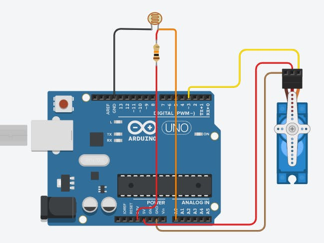

# MiPrimerServo
Mi primer servomotor controlado con Arduino

## Descripción de funcionamiento

Este proyecto consistirá en conectar un LDR que controle el movimiento de un servomotor

toDo: subir el codigo

toDo: subir esquemático

## Imagen de referencia (extraída de google)

